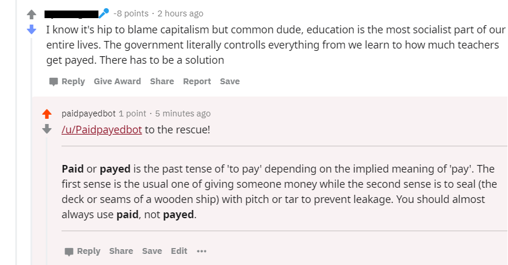

# paidpayedbot

I created this bot to practice Python, learn how to scrape websites with an API, learn how to scrape Reddit, and most importantly, to annoy a great number of people by correcting a common grammar mistake. 

# bot in action

